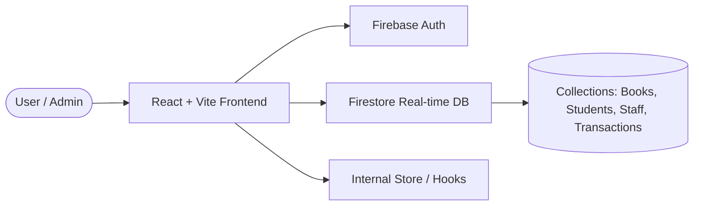
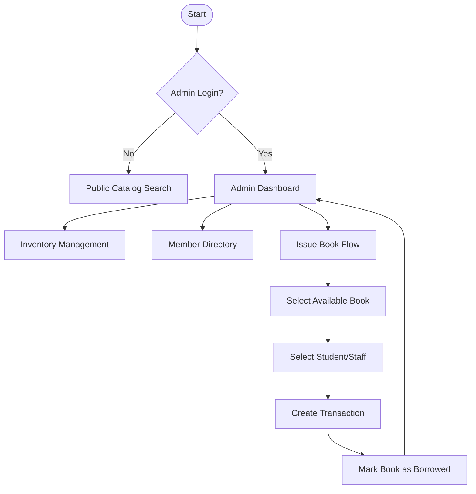
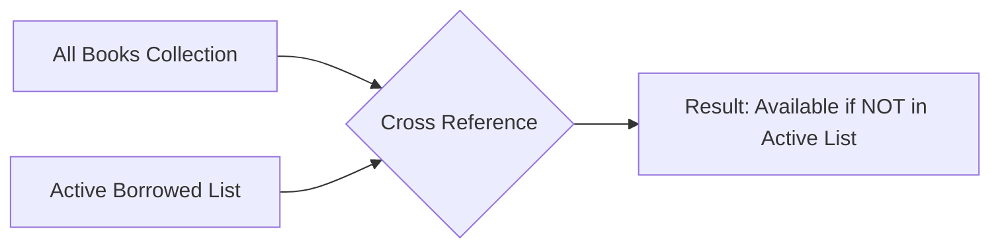
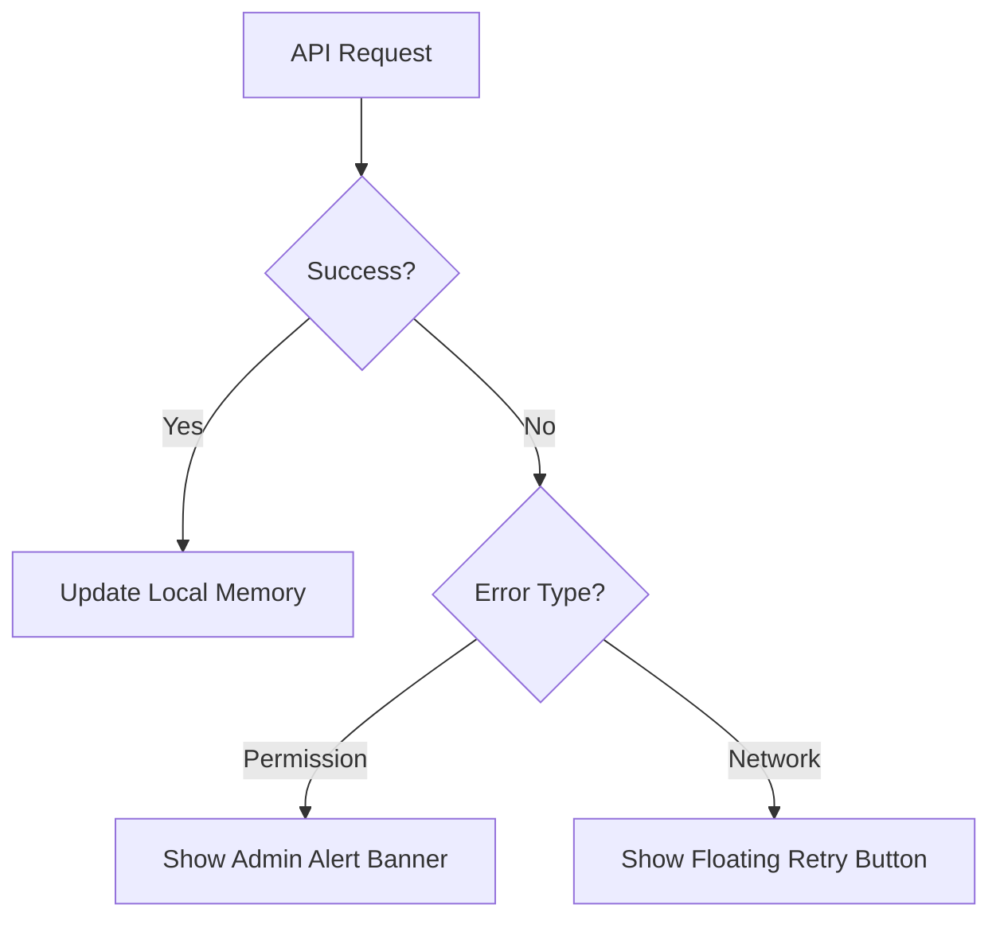
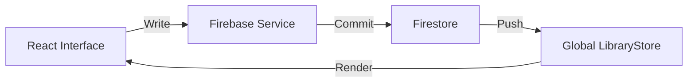
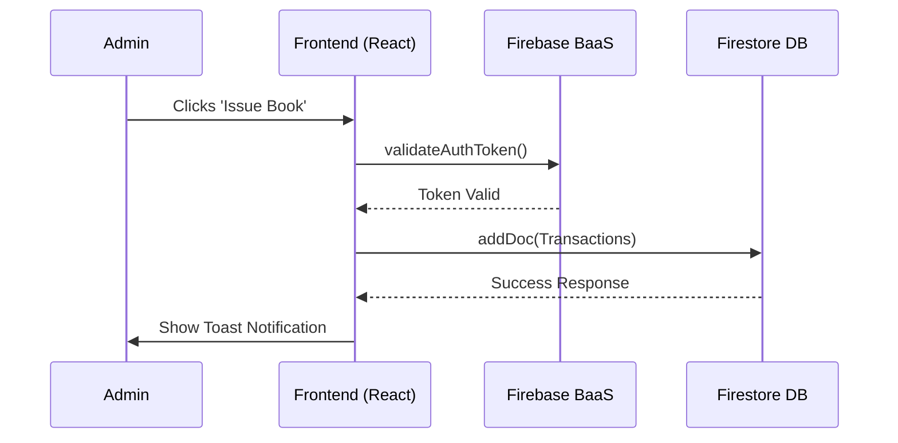
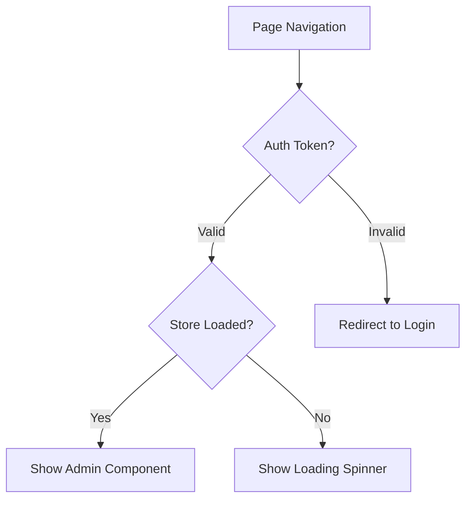

# SmartLib – Advanced Library Management System

  
  
<em>A modern, high-performance library management console built for speed, security, and scalability.</em>

---

## 1. Project Overview

### Concept

**SmartLib** is a comprehensive, enterprise-grade Library Management System (LMS) designed to transition traditional paper-based or legacy library operations into a modern, digital ecosystem.

### Why it exists

Educational institutions and corporate libraries often struggle with real-time inventory tracking, member accountability, and transaction history. SmartLib solves these pain points by offering a reactive dashboard where every book, member, and transaction is synced instantly via cloud infrastructure.

### Target Audience

- **Librarians/Administrators**: Who need a centralized console to manage inventory and circulation.
- **Students/Staff**: The beneficiaries who borrow resources and need a searchable catalog.
- **Institution Management**: Who require data-driven insights into library usage and resource turnover.

### Technical & Business Goals

- **Real-time Accuracy**: Zero latency between a book being issued and its status being updated across all users.
- **Operational Efficiency**: Reduce time spent on manual entry with a streamlined UI.
- **Data Integrity**: Ensure historical records of all transactions are immutable and easily auditable.

---

## 2. Feature List (A–Z)

- **Admin Console**: A centralized real-time dashboard displaying high-level circulation metrics.
- **Book Inventory (CRUD)**: Full lifecycle management of resources from procurement to deletion.
- **Client-side Filtering**: Instantaneous result narrowing for thousands of books using local cache.
- **Departmental Allocation**: Segmented member management for Students (UG/PG) and Staff.
- **Email Receipt Engine**: Automated Issue/Return notifications via EmailJS integration.
- **Flow-based Availability**: Real-time status merging between books and active transactions.
- **Glassmorphic Receipts**: Premium UI for digital records with PDF-like visual fidelity.
- **Historical Auditing**: Perpetual log of all library transactions for accountability.
- **Issue/Return Lifecycle**: Simplified 3-click workflow for resource circulation.
- **JSON-based Schema**: Type-safe data structures ensuring zero-null pointer exceptions.
- **Key-based Auth**: Secure administrative entry protected by Firebase Authentication.
- **Live Synchronization**: Firestore-native websocket listeners for multi-device data parity.
- **Member Directory**: Categorized database of all academic and professional library users.
- **Navigation (Role-based)**: Dynamic Navbar logic that hides admin tools from the public.
- **Overdue Monitoring**: Visual flagging of late returns with color-coded urgency.
- **Performance Analytics**: Performance tags (Early/On-Time/Late) for borrower behavior analysis.
- **Quick Search**: Optimized public catalog explorer for guest use.
- **Real-time Dashboards**: Reactive UI components that update without page refreshes.
- **Security Guards**: HOC (Higher-Order Components) protecting sensitive API endpoints.
- **Tailwind Styling**: Modern, slate-and-violet themed utility-first design system.
- **User Onboarding**: Streamlined creation of member profiles with program-specific metadata.
- **Vite Performance**: Ultra-fast build and hot-module replacement for development speed.
- **Websocket-like Listeners**: Leveraging Firestore Snapshots for persistent server-client link.
- **X-Platform Compatibility**: Fully responsive layout optimized for Mobile, Tablet, and PC.
- **Y-Axis Responsive Grids**: Intelligent layout adaptation using CSS Grid and Flexbox.
- **Zero-Latency State**: Local buffering strategies that make the app feel instant.

---

## 3. User Roles & Access Control

### Role: Administrator

- **Permissions**: Full Access.
- **Capabilities**: Add/Edit/Delete Books, Add/Manage Members, Issue/Return Books, View detailed Transaction History, Access Analytics.
- **Security**: Protected by Firebase Authentication and custom `ProtectedRoute` logic.

### Role: Public User (Explore Only)

- **Permissions**: Read-only (Search).
- **Capabilities**: Search for books by title or ID to check availability.
- **Restricted**: Cannot see member emails, IDs, or history.

---

## 4. System Architecture

SmartLib follows a modern **Serverless Client-Side Architecture**, leveraging Firebase as a Backend-as-a-Service (BaaS).

**Explanation**:
The frontend is a React application built with Vite for maximum performance. Authentication is handled by Firebase Auth. Instead of a traditional REST API, the application communicates directly with Google Firestore using real-time SDKs, ensuring that changes made by one admin are instantly visible to others.

---

## 5. Application Workflow (End-to-End)

### Lifecycle Phases:

1. **Onboarding**: Admin creates staff and student records in the Member Directory.
2. **Library Setup**: Admin populates the Inventory with book data.
3. **Daily Ops**:
   - A member requests a book.
   - Admin uses the "Issue Book" tool.
   - System updates the book status and creates a Transaction record.
4. **Closing the Loop**: When the book is returned, the Transaction is marked as "returned", and the book becomes "Available" again.

---

## 6. Business Logic: Availability & Performance

One of the most complex parts of the system is the **Availability Logic**. Since multiple copies might exist, the system calculates "Is Available" dynamically.

### Availability Algorithm

### Performance Tagging Logic
The system automatically evaluates returns:
- **`today < duedate`** = 🔵 Early
- **`today === duedate`** = 🟢 On-Time
- **`today > duedate`** = 🔴 Late

---

## 7. Error Handling & Connection Resilience

The system manages network instability and permission errors gracefully.

---

## 8. User Journey Flow (Role-Wise)

### Admin Journey

### Public User Journey

---

## 9. Database Design & Data Flow

### Database Choice: Google Firestore

We chose Firestore for its **real-time synchronization** and **automatic scaling**.

### Collections & Schema

| Collection       | Key Fields                      | Relationships               |
| :--------------- | :------------------------------ | :-------------------------- |
| **books**        | Name, Author, ID, Publication   | Foreign Key in Transactions |
| **students**     | Name, Regno, Program, Education | Foreign Key in Transactions |
| **staff**        | Name, StaffID, Department       | Foreign Key in Transactions |
| **transactions** | BookID, MemberID, Dates, Status | Polymorphic Relation        |

### CRUD Flow

---

## 10. API & Integration Flow

SmartLib uses the **Firebase JS SDK v12** for all data operations.

---

## 11. Security & Authentication Flow

Security is implemented at both the **Application Layer** and the **Database Layer**.

- **App Layer**: `ProtectedRoute.tsx` prevents unauthorized navigation.
- **DB Layer**: Firestore Security Rules ensure only authenticated administrators can write to the database.

---

## 12. Performance & Scalability

- **Vite Bundling**: Fast HMR and optimized production builds for quick page loads.
- **Snapshot Buffering**: The `LibraryStore` caches data locally, providing near-instant UI reactivity.
- **Lazy Loading**: Admin modules are only loaded when accessed, reducing the initial payload.

---

## 13. Deployment & Environment Setup

- **Production**: Hosted on Firebase Hosting for global CDN delivery.
- **Environment**: Managed via `.env` files for API keys and configuration strings.
- **Build Tool**: Vite, providing optimized chunking for fast paint times.

---

## 14. Client Handover Notes

- **Credentials**: Passwords should be managed through the Firebase Auth console.
- **Service Limits**: Monitor EmailJS daily limits (Free tier supports 200 emails/day).
- **Support**: Technical documentation is stored in this repository under `/types`.

---

## 15. Core File Structure & Logic (Technical Deep-Dive)

To ensure long-term maintainability, the codebase follows a strict separation of concerns. Below is an explanation of the primary architectural components:

### 📂 /firebase

- **`libraryStore.ts`**: The "Heart" of the application. It implements a Singleton pattern that manages a global state of all books, students, and staff. It uses `onSnapshot` to create a permanent websocket connection to Firestore, ensuring the UI updates in real-time without manual refreshes.
- **`transactionService.ts`**: Contains the atomic logic for creating loan records and updating book statuses. This handles the "Write" side of the circulation logic.
- **`authService.ts`**: Manages administrative sessions, login persistence, and logout redirections using Firebase Auth.

### 📂 /admin

- **`IssueBook.tsx`**: A sophisticated form controller that manages the multi-step "Issue" process. It includes validation logic, future return-date calculation, and triggers automated email notifications via EmailJS.
- **`BookManagement.tsx`**: The administrative interface for Inventory Control. It handles complex form states for adding/editing book metadata and communicates with `bookService.ts`.
- **`AdminHome.tsx`**: Aggregates data from `LibraryStore` to calculate and display high-level metrics (Available vs. Borrowed) using optimized React `useMemo` hooks.

### 📂 /auth

- **`ProtectedRoute.tsx`**: A Higher-Order Component (HOC) that guards sensitive routes. It performs two critical tasks:
  1. Verifies the user's authentication token.
  2. Ensures the `LibraryStore` is fully synchronized (Prefetched) before the child component renders, preventing "Flash of Unstyled Data" (FOUD).

### 📂 /public

- **`BookSearch.tsx`**: A optimized, read-only search engine. It uses fuzzy matching logic to allow users to find books by Name, Author, or ID without direct database access (queries the locally cached store for speed).

### 📂 /types

- **`Book.ts` & `Transaction.ts`**: Defines the TypeScript Interfaces that act as the "Contract" for the entire system. Any changes to the database schema are reflected here first to ensure compile-time safety.

---

## 16. A-Z Granular Code Logic & Request Lifecycle

This section provides a line-by-line conceptual breakdown of how the mission-critical files function.

### A. The Real-Time Engine: `libraryStore.ts`
1. **The Singleton Structure**: The `store` instance is shared across the entire app.
2. **`init()` Method**: Sets up 4 `onSnapshot` listeners. This is why the app never requires manual refreshing.
3. **Data Mapping**: In `libraryStore.ts`, line 43: `snap.docs.map(d => ({ ...d.data(), id: d.id }))` handles the heavy lifting of raw data normalization.

### B. The Transaction Guard: `IssueBook.tsx` & `BorrowedList.tsx`
1. **Issue Logic**: Line 74 in `IssueBook.tsx` triggers `createTransaction`. At this exact moment:
   - A unique ID is generated by Firestore.
   - The book is marked as "borrowed" in the transaction log.
2. **Email Lifecycle**: In `emailService.ts`, the `notifyBorrow` function maps `bookName` and `returnDate` to the EmailJS template.

### C. The History & Intelligence Mapper: `BorrowedList.tsx` & `AdminSearch.tsx`
1. **Performance Hook**: In `BorrowedList.tsx` (Line 19), `getPerf()` calculates efficiency by comparing `actualReturnDate` vs `returnDate`. It converts millisecond deltas into human-readable performance tags.
2. **Loan Aggregation**: In `AdminSearch.tsx`, the system implements a **Frequency Analyzer** (Line 20). It iterates through the entire transaction history to build a `loanCounts` map. This allows administrators to see at a glance how many copies of a specific ID are currently in circulation, enabling data-driven procurement decisions.
3. **Availability Discrepancy Logic**: 
   - **Catalog View**: Shows a binary "Ready" vs "Lent Out" based on whether *at least one* transaction exists for that ID.
   - **Issue Logic**: Allows "Infinite Issuing" for IDs. This is a deliberate design choice for libraries that stock multiple physical copies under the same registration number, allowing concurrent loans of the same title.

### D. The Access Guard: `ProtectedRoute.tsx`
1. **Line 17**: `store.init(() => setDataReady(true))` is the most critical line for stability. It prevents the UI from rendering until the background sync is complete, avoiding empty data states or "null" reference crashes.
2. **Permission Proxy**: It monitors `store.hasErrors`. If a Firebase "Permission Denied" error is caught during the initial sync, it proxies this state to a global banner, ensuring the Librarian is aware of database-level restrictions.

---

## 17. UI Aesthetics & Component Architecture

SmartLib isn't just a management tool; it's a **Premium Visual Experience**.

- **Glassmorphism**: Navigation and Modals use `backdrop-blur-xl` and semi-transparent white backgrounds to create depth and a modern "Apple-like" feel.
- **Micro-Animations**: Uses `animate-pulse` for active indicators and `transition-all` on all hoverable items for fluid interaction feedback.
- **Typography**: Optimized using the **Inter** font family (via Tailwind's slate/slate-900 palette) for maximum legibility in high-density data tables.
- **Responsive Grids**: The `BookTable` component is wrapped in an overflow-container with specialized `min-w` declarations, ensuring data remains readable on mobile without breaking the layout.

---

## 18. Conclusion

**SmartLib** represents a significant leap forward for library administration. By combining a robust technical stack with a user-centric design approach, the system provides a scalable foundation for any institution looking to modernize its resource management. Its reliability, speed, and real-time capabilities ensure that library staff can focus on what matters: serving their community.

---
